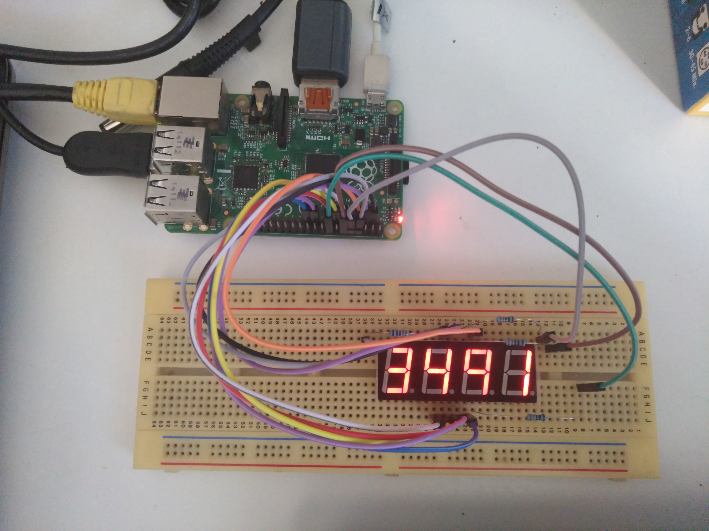
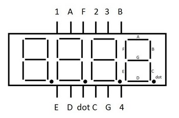

# Rpi-7segments

Python scripts for running a 4-digit common cathode 7 segment display to show Raspberry pi IP.

## Components list
- Raspberry Pi B+
- HS420564K-32 7 segments display
- 4x 330 ohms
- 12x male-female Jump wire

## HS420564K-32 Connections

| HS420564K-32 | Raspberry Pi GPIO BOARD |
|---|---|
| A | 3 |
| B | 7 |
| C | 19 |
| D | 13 |
| E | 11 |
| F | 5 |
| G | 21 |
| dot | 15 |
| 1 | 8 |
| 2 | 10 |
| 3 | 12 |
| 4 | 16 |

### File hierarchy

| Configurations | |
|----|---|
| seg_light.json | 0-9 digits to 7 segments convertion
| seg_light_space.json | 0-9 digit plus space to 7 segments convertion
| seg_light_full.json | 0-9 digits plus space and letter E to 7segments convertion

|Python scripts| |
|---|---|
| segtest.py | For a single digit light up each segment individually |
| manual_segments.py | Input dot separeted string with segments to display |
| manual_number.py | Translate inputed number to 7 segments display |
| 2segstest.py | Display elements in two displays, testing the frequency of display selection |
| fullsegstest.py | Display a random four digit number |
| input_segs.py | Display inputed digit, with space padding |
| ip_segs.py | Display ip on 4 digit 7 segment display |
